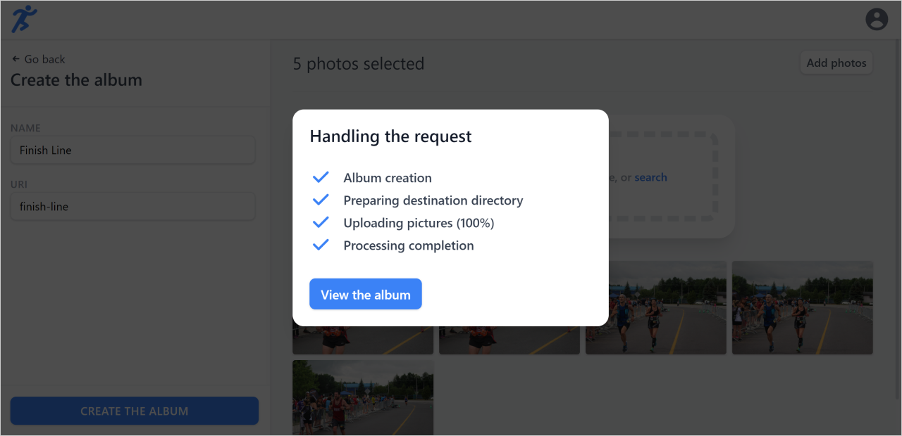

# 📷 RunApp <a href="#-project-status"></a>

A running events smart photo hosting platform that improves the lives of runners by providing them with a tool to easily search for their race pictures.

## Table of contents <!-- omit in toc -->

- [☀ Introduction](#-introduction)
- [🎯 Motivation](#-motivation)
    - [🧠 Play around with AI technologies](#-play-around-with-ai-technologies)
    - [🌐 Try out the OpenAPI API standards](#-try-out-the-openapi-api-standards)
    - [📂 Work with file uploads](#-work-with-file-uploads)
    - [💳 Setup the Stripe API](#-setup-the-stripe-api)
- [📷 Preview](#-preview)
  - [📢 For the race organizer](#-for-the-race-organizer)
    - [Login page](#login-page)
    - [Account page](#account-page)
    - [Browse organizations page](#browse-organizations-page)
    - [Organization creation page](#organization-creation-page)
    - [Organization page](#organization-page)
    - [Event creation page](#event-creation-page)
    - [Event page](#event-page)
    - [Album creation page](#album-creation-page)
  - [🏃‍♂️ For the visitor](#️-for-the-visitor)
    - [Organization page (visitor)](#organization-page-visitor)
    - [Event page (visitor)](#event-page-visitor)
    - [Photo component](#photo-component)
- [💿 Setup](#-setup)
  - [Prerequisites](#prerequisites)
  - [Installation steps](#installation-steps)
  - [Usage](#usage)
- [🛠 Technologies Used](#-technologies-used)
  - [Frontend](#frontend)
  - [Backend](#backend)
- [🚦 Project Status](#-project-status)
  - [💭 Learnings](#-learnings)
  - [🗺 What I would do differently](#-what-i-would-do-differently)

## ☀ Introduction

At my second last university semester of my computer science bachelor's degree (Fall 2021), my peers and I were tasked to gather in teams of 2 to 4 people and dedicate 9 to 18h/week to the creation of a new project or the development of an existing one.

We could either come up with a project of our own, as long as we found a sponsor that could supervise our progress, or we could go with one of the suggested projects by the faculty's professors and staff members.

I had a couple of ideas in mind for projects I wanted to work on and this opportunity to dedicate school time to one of them was pure excitement. 🙌

Being an amateur triathlete, I have experienced the long process of searching for my race pictures in shared albums that often contain thousands of images. I was convinced that I could come up with a better photo hosting solution. The main feature would be the ability to search for one's pictures by entering its bib number in a search bar.

I was quite enthusiastic about this idea, my only concern was that I had to find at least one person that would agree to join me.

Luckily, [William O'Sullivan-Dargis](https://www.linkedin.com/in/william-o-sullivan-dargis-97a2141a9/) and [Étienne Boutet](https://www.linkedin.com/in/etienne-boutet/), both talented developers, answered that call.

## 🎯 Motivation

My goals for this project were to...

#### 🧠 Play around with AI technologies

I had recently watched the [Deep Learning series](https://www.youtube.com/watch?v=aircAruvnKk) by [3Blue1Brown](https://www.youtube.com/channel/UCYO_jab_esuFRV4b17AJtAw) on YouTube. For the first since I came across the concept, I truly got interested in AI. Seeing how he explained part of the magic that was happening behind the scene made me want to use similar technologies in a project. Now, I was pretty sure that I was not going to build my own models and networks, but I knew that cloud providers like AWS and GCP provided some pre-implemented solutions in the form of API services.

#### 🌐 Try out the [OpenAPI](https://swagger.io/specification/) API standards

Some of the main problems I encountered in previous projects are related to the lack of end-to-end typing. I had recently learned that there existed _API client_ generators out there for OpenAPI compliant services. I figured that I should try this out in this project.

#### 📂 Work with file uploads

The typical "Todo List" web application often limits its scope to traditional CRUD operations on objects stored in a data store. In this project, I wanted to put my hands on file uploading and processing.

#### 💳 Setup the Stripe API

I've been informed from many different sources that the Stripe API is a breeze to work with. If I would have had more time, I wanted to implement it in this app to provide organizers with a way to sell photo packages.

## 📷 Preview

As you'll see in the upcoming screenshots, we tried not to reinvent the wheel when it comes to design in this project. We **highly** inspired ourselves from the Facebook content forms and the Google Photos photo component.

### 📢 For the race organizer

#### Login page

The login page allows the race organizer to log in with either a traditional email/password combination or with a social provider.


#### Account page

The account page contains very little content. It was intended to hold more features but we had to reduce our scope due to time limitations.


#### Browse organizations page

The browse organizations page shows the user's organizations. When the user does not have an organization yet, we present a neat little invitation for him to create one.


#### Organization creation page

The organizer can enter his organization name and customize the URI that gets automatically filled. A logo and banner can also be selected. Finally, the organizer can visualize what his organization will look like in a mobile/desktop preview.


#### Organization page

The organizer can manage his organization in the organization's page admin menu on the left of the page. If the organization does not contain events yet, we kindly suggest he creates his first event.


Once events have been created, they are listed on the page.


#### Event creation page

The create event page follows the same concepts as the [create organization page](#create-organization-page).


#### Event page

The event page presents the event's photos.


If there are no albums yet created, we invite the organizer to create his first album.


#### Album creation page

The create album page allows the organizer to create his album and drag & drop his photos into it.


When the organizer clicks on _Create the album_, we display a modal showing the progress status.



### 🏃‍♂️ For the visitor

#### Organization page (visitor)

The visitor's view of the organization is the same as the organizer's but without the admin panel on the left side of the window.


#### Event page (visitor)

Same concept as the [organization page](#organization-page-visitor).


#### Photo component

The visitor can look at a picture by clicking on it. From there, he can also download the photo or share it on social media.


## 💿 Setup

### Prerequisites

- [JavaJDK](https://openjdk.java.net/install/) (1.8+ required to run the Firebase Emulators)
- [NodeJS](https://nodejs.org/en/) (We used v16.13.2)

### Installation steps

> ⚠️ Since this project has been archived, the build steps provided below help you with setting up the app in the local Firebase emulators for local experimentation only. No Firebase projects need to be created in GCP.

Setup the backend running in local Firebase emulators by following these steps:

```sh
# Move into the functions directory
cd backend/functions

# Install the dependencies
npm install

# Build the backend
npm run build
```

Setup the frontend NextJS application by following these steps:

```sh
# Move into the frontend directory
cd frontend

# Install the dependencies
npm install

# Build the development app
npm run build
```

### Usage

In one terminal, start the firebase emulators:

```sh
# Move into the backend/functions directory
cd backend/functions

# Start the firebase emulators
npm run emulators
```

> 🔦 The first time you run the emulators, it might take a bit longer as the emulators must be downloaded on your machine.

In another terminal, start the frontend application:

```sh
# Move into the frontend directory
cd frontend

# Start the app
npm start

# If you prefer to start the development app
npm run dev
```

Access the application at http://localhost:3000/. You can also view the current state of the emulators at http://localhost:4000/.

## 🛠 Technologies Used

### Frontend

- [NextJS 10.0.0](https://nextjs.org/docs/getting-started) - Production-ready React framework
- [Firebase 9](https://firebase.google.com/) - Google-backed backend as a service
- [TailwindCSS 2.2.15](https://v2.tailwindcss.com/) - Utility-based CSS framework
- [HeadlessUI 1.4.1](https://headlessui.dev/) - Unstyled accessible UI components
- [Formik 2.2.9](https://formik.org/) - React forms library
- [React Query 3.26.0](https://react-query.tanstack.com/overview) - Data synchronization solution for React apps

### Backend

- [Firebase 9](https://firebase.google.com/) - Google-backed backend as a service
- [Express 4.17.1](https://expressjs.com/en/4x/api.html) - NodeJS web framework
- [TSOA 3.13.0](https://tsoa-community.github.io/docs/introduction.html) - TypeScript MVC framework
- [Google Cloud Vision API](https://cloud.google.com/vision) - Computer vision API (disabled in this demo)

## 🚦 Project Status


My initial plans were to bring this product to market, but my poor feature prioritization and the lack of quality insurance on this project made me rethink that intention.

We ended up using the Google Cloud Vision AI API to search for the bib numbers in the uploaded photo. The results were mitigated. Sometimes our system would find numbers that we ourselves struggled to see in images, 🤩 but other times the algorithm would miss obvious numbers. 😢

In the end, my colleagues agreed for me to archive this project publicly on GitHub so that others could benefit from the experience. 💪

### 💭 Learnings

**When starting a project, ask yourself where does the value lies? And then build just that.**

In the case of this platform, the value was in the runner being able to search for his photos by entering his bib number, it was not in the organizer being able to independently create his organization, his events, etc.

It would have been much easier for him to send us his photos and have us set up his page.

No work is required on his end.

Sure, the self-serve component of the product is interesting, but it would have been better to keep it for a future version of the application.

Here's how such a service-oriented approach would have been better:

1. **Using AI as human-help rather than human-replacement**

   The main problem with our current solution is that we have no way of knowing in advance which photos have been properly identified or not. Since the organizer could instantly share his albums after creating them on the platform, the quality of service was far from certifiable.

   Rather than rely entirely on AI for bib number recognition and have mitigated results, we could have used computer vision as an aid to manual identification, (at least initially until our system would have proven itself reliably effective) giving us much more confidence in the quality of our service.

   Sure, this solution would not work in the case of a system used by hundreds of organizations. Nonetheless, it would have been the perfect approach for the first few customers:

   "Do things that don't scale" — [Paul Graham 2013](http://paulgraham.com/ds.html)

2. **Unlimited processing time**

   One of the challenges we encountered during development was that each photo had to be processed individually and rapidly in a single cloud function execution.

   Being able to process images locally, or at least not "instantly as the organizer uploads them" and in **batch** would have given us more processing opportunities.

   We could have tried techniques like face recognition/matching to provide an even better experience.

3. **Cost control**

   The nice thing about a self-serve application is that once deployed, it is completely hands-off.

   The not-so-nice thing about such a solution is the lack of cost control unless properly implemented.

   Even then, when using cloud services, it is not so simple to set this up as everything is _pay-per-use_ and again goes back to the fact of doing a lot of work that does not provide much value to the end-user.

### 🗺 What I would do differently

If I ever decide to give this project idea another shot, here's how I will go about it:

1. Create a simple website that would be composed of:
   - ✔ Landing page providing information about the service
   - ✔ Contact form for organizations to reach me
   - ❌ No pricing page
   - ❌ No authentication page
   - ❌ No organizations / events / albums forms
2. Build the event page template with fantastic search and filtering options.
3. Get in contact with running organizations to provide them with the service for free. No work is needed on their part other than sending me their event photo collections. If they don't like the result, they don't have to share it. It is a risk-free deal.
4. Process each image on my local machine / a cloud server instance and ensure each bib has been properly identified.
5. Create the _read-only_ page for the event on the website.
6. Send the event page link to the organization so that it could share it with its participants.
7. Repeat with other organizations, going from a free service to a paid one as the demand increases. This would allow me to iterate on pricing without infuriating existing customers.

#### 🔗 Check out my other [**projects**](https://github.com/vcheeney) on my GitHub profile <!-- omit in toc -->
